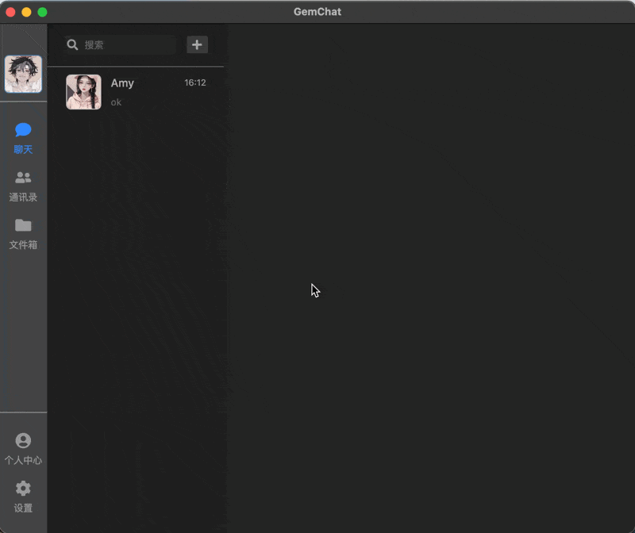

# GemChat-client
A modern-style PC chat application client with an exquisite UI and elegant interface. It supports local database storage, file storage, as well as user chat and local chat file management functions.

一款现代风格的 PC 端聊天软件客户端，拥有精致 UI 与美观界面，支持本地数据库存储、文件存储，以及用户聊天、本地聊天文件管理功能。

## Display



## Main Tech Stack
- Typescript
- React
    - react-query
    - react-router
    - react-redux
- electron
- database
    - Sqlite
- vite

## Project Setup
这个客户端主进程'src/main/*'中的服务需要服务端提供高度的支持，所有的Http请求的后端接口都在'src/main/axios'目录下，数据在'src/shared/types'中有相关定义，聊天功能的则是基于基于自定义的轻量级消息协议，见'src/main/tcp-client/protocol'，需要准备TCP服务器，文件发送和上传基于aliyun-oss的“OSS Browser.js SDK”，需要配置STS服务器。

具体后端服务器实现可见：[GemChat-Server](https://github.com "GemChat-Server")

### Install

```bash
$ npm install
```

### Development

```bash
$ npm run dev
```

### Build

```bash
# For windows
$ npm run build:win

# For macOS
$ npm run build:mac

# For Linux
$ npm run build:linux
```
