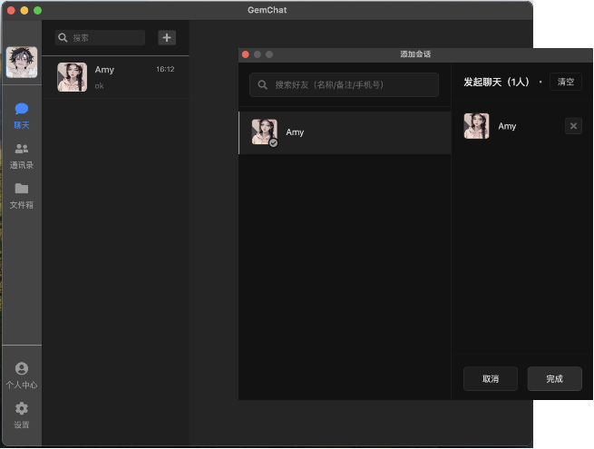
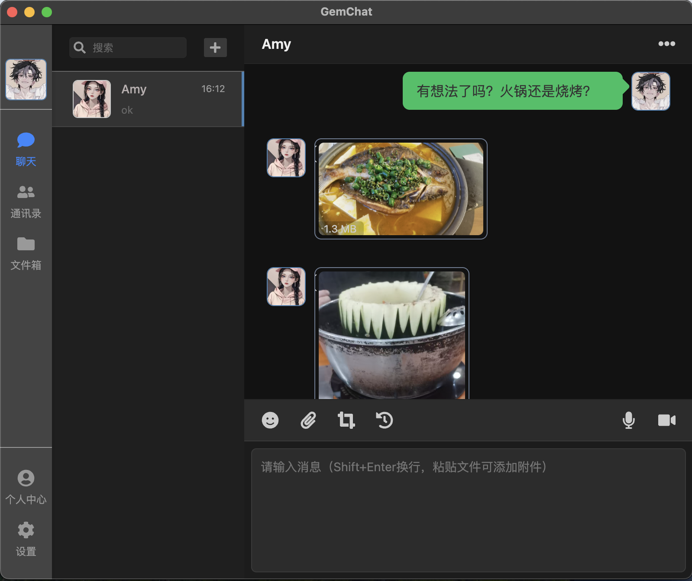
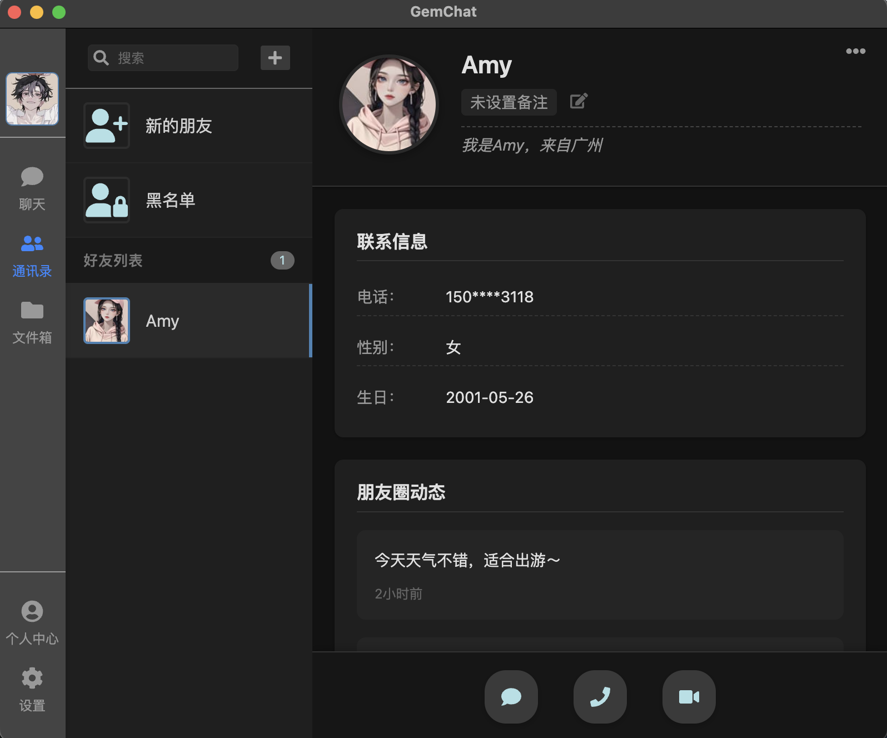
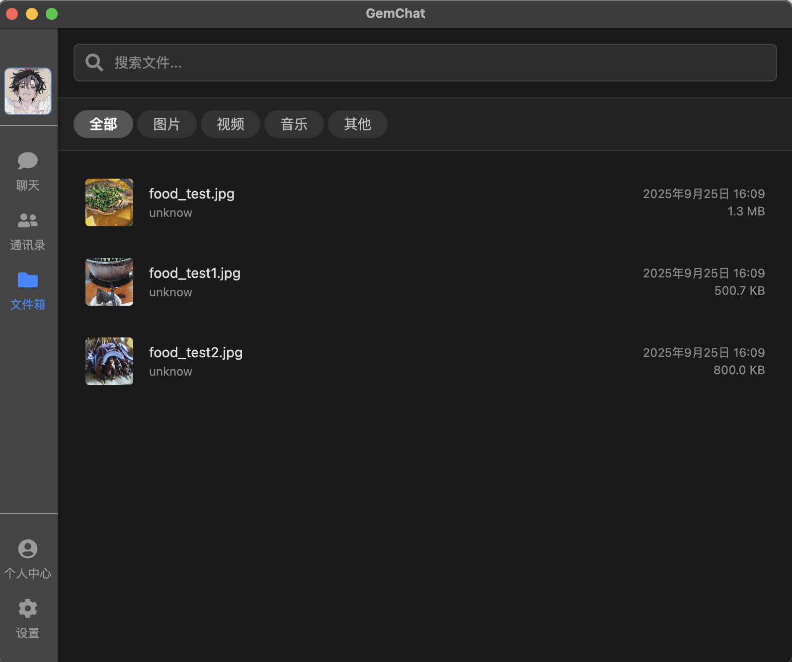

<div align="center">
  
</div>

# <center>GemChat-client</center>

A modern-style PC chat application client with an exquisite UI and elegant interface. It supports local database storage, file storage, as well as user chat and local chat file management functions.

---

一款现代风格的 PC 端聊天软件客户端，拥有精致 UI 与美观界面，支持本地数据库存储、文件存储，以及用户聊天、本地聊天文件管理功能。

## Display






## Main Tech Stack
- Typescript
- React
    - react-query
    - react-router
    - react-redux
- electron
- database
    - Sqlite
- vite

## Project Setup
The services in the client's main process (src/main/*) rely heavily on backend support: all backend interfaces for HTTP requests are located in the src/main/axios directory; data type definitions can be found in src/shared/types; the chat function is based on a custom lightweight messaging protocol (see src/main/tcp-client/protocol) and requires a TCP server; file sending and uploading use Alibaba Cloud OSS's "OSS Browser.js SDK" and require an STS server configuration.

For the specific implementation of the backend server, please refer to:[GemChat-Server](https://github.com "GemChat-Server")

---

客户端主进程（src/main/*）中的服务高度依赖服务端支持：所有 HTTP 请求的后端接口集中在src/main/axios目录；数据类型定义位于src/shared/types；聊天功能基于自定义轻量级消息协议（详见src/main/tcp-client/protocol），需搭配 TCP 服务器使用；文件收发则依托阿里云 OSS 的 “OSS Browser.js SDK”，需提前配置 STS 服务器。

具体服务端实现可见：[GemChat-Server](https://github.com "GemChat-Server")

### Install

```bash
$ npm install
```

### Development

```bash
$ npm run dev
```

### Build

```bash
# For windows
$ npm run build:win

# For macOS
$ npm run build:mac

# For Linux
$ npm run build:linux
```
